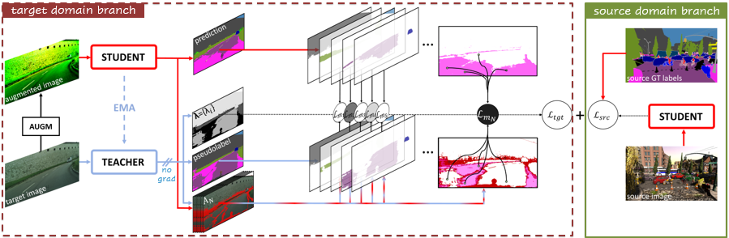

# MC-PanDA: Mask Confidence for Panoptic Domain Adaptation (ECCV 2024)

[](https://paperswithcode.com/sota/domain-adaptation-on-panoptic-synthia-to?p=mc-panda-mask-confidence-for-panoptic-domain)\
[](https://paperswithcode.com/sota/domain-adaptation-on-panoptic-synthia-to-1?p=mc-panda-mask-confidence-for-panoptic-domain)

This repo contains the code for our paper [**MC-PanDA: Mask Confidence for Panoptic Domain Adaptation**](https://arxiv.org/pdf/2407.14110).

<div align="center">
  
</div><br/>

## Installation
See [installation instructions](INSTALL.md) for MC-PanDA.
## Getting Started
- See [Datasets preparation](datasets/README.md) for MC-PanDA.
- See [training and eval scripts](GETTING_STARTED.md) for MC-PanDA.
## Model Zoo
See MC-PanDA [MODEL ZOO](MODEL_ZOO.md).
## Acknowledgments
This project is based on the following open-source projects. We thank their authors for making the source code publically available:
- [Mask2Former](https://github.com/facebookresearch/Mask2Former/tree/main)
- [detectron2](https://github.com/facebookresearch/detectron2/tree/main)
- [EDAPS](https://github.com/susaha/edaps)
## Citing MC-PanDA
If you use MC-PanDA in your research, please use the following BibTeX entry.

```BibTeX
@inproceedings{martinovic2024eccv,
  title={MC-PanDA: Mask Confidence for Panoptic Domain Adaptation},
  author={Martinovi{\'c}, Ivan and {\v{S}}ari{\'c}, Josip and {\v{S}}egvi{\'c}, Sini{\v{s}}a},
  booktitle={European Conference on Computer Vision},
  pages={167--185},
  year={2025},
  organization={Springer}
}
```